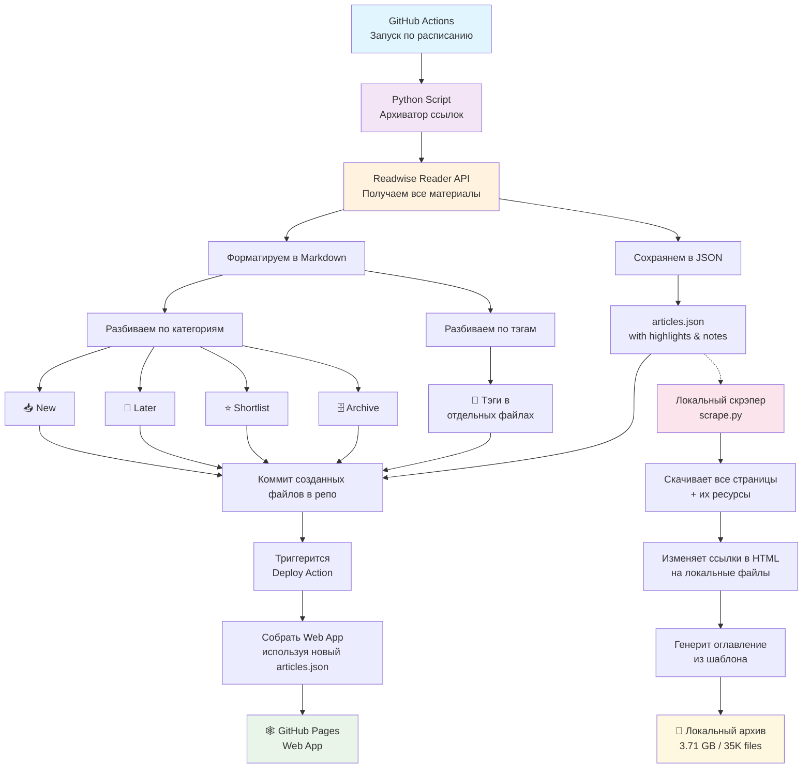

# Архив ссылок Readwise Reader

Утилита сохраняет все мои ссылки с highlights и заметками к ним из Readwise Reader в Markdown-отчёты и JSON-файл для архивации и удобного доступа к ним.

- 🔗 Ссылки в Markdown: 📥 [Новые](./links/new.md) | 🔎 [Отложенные](./links/later.md) | ⭐ [Shortlist](./links/shortlist.md) | 🗄️ [Архив](./links/archive.md) | 🔖 [По тэгам](./links/tags/inspiration.md)
- 🕸️ [Веб-приложение](https://hazadus.github.io/readwise-links/)

## Что за Readwise Reader?

[Readwise Reader](http://read.readwise.io) – совершенно прекрасная софтина, позволяющая сохранять ссылки и любые материалы (посты, видео, PDF, книги), и потом читать их онлайн или через приложение на телефоне. Платная, но работает просто идеально. Пользуюсь ей ежедневно, и читаю всё через неё.

Reader объединяет в себе приложения нескольких классов: read later, хранилище ссылок, читалка. Можно даже кинуть в неё любой текст или письмо по email, и оно сохранится к прочтению во входящих. Можно смотреть видео YouTube, не отвлекаясь на предложения других видео, как это происходит на сайте. При этом, будет доступна транскрипция текста, который можно выделять и сохранять в заметки – очень полезно для учебных материалов. Для сохранения материалов предусмотрены плагины для браузеров. Если установить приложение на телефон, ссылки можно сохранять через него стандартными средствами системы. Причем и в плагинах, и в приложении при сохранении можно сразу присвоить теги или выбрать папку для сохранения (новые, отложенные и т.п.).

Возможностей и фишек ещё очень-очень много, но необязательно пользоваться ими всеми сразу. Вообще, меня не покидает мысль, что авторы сервиса прилагают очень много усилий для того, чтобы пользователь не отвлекался от главного – чтения.

Я сохраняю все интересные материалы в Readwise, и читаю через него. Если на странице слишком сложная вёрстка или много примеров кода, можно легко открыть оригинальную страницу. Если материал оказался негодным, я удаляю его. Таким образом, в архиве остаются только ценные ссылки.

Рекомендую попробовать Readwise абсолютно всем, кто любит читать, и читает много блогов, книг, постов в интернете.

## Зачем нужно архивировать ссылки?

Если программа такая крутая, зачем из неё сохранять материалы ещё куда-то?..

Всё хорошее когда-то заканчивается, и софт тоже не вечен. Раньше я пользовался аналогичным, но бесплатным сервисом Omnivore. Мне хватало его возможностей. Но в один прекрасный день владельцы решили его закрыть! Пришлось перейти на Readwise. До этого я осознанно не пробовал Readwise, потому что он платный. Попробуй я его раньше, перешёл бы ещё до кончины Omnivore!

Я к тому, что мне не хотелось бы в один прекрасный день потерять ссылки на все накопленные материалы. Я частенько ищу нужные материалы в Readwise, поэтому нужно быть уверенным, что они никуда не исчезнут.

Добавлю, что существует официальный плагин для экспорта заметок из Readwise в Obsidian. Работает замечательно, тоже пользуюсь и рекомендую.

## Как это работает?

1. По расписанию каждую ночь запускается GitHub Action, который выполняет скрипт архивации ссылок.
2. Скрипт:

- запрашивает через API Reader все материалы, сохраненные в моём профиле
- форматирует полученную инфу в Markdown и сохраняет в файлы с разбивкой:
  - по разделам – новые, отложенные, архивные и т.д.
  - по тэгам
- сохраняет в файле формата JSON все ссылки с highlights и заметками к ним
  для использования в фронтовом приложении

3. Action коммитит созданные файлы в репо.
4. Запускается Action сборки и деплоя веб-приложения, которое собирается с использованием актуального JSON-файла с данными обо всех ссылках и деплоится на GitHub Pages.

В итоге, мы получаем актуальные списки ссылок и архив в виде истории коммитов. Ссылки доступны как в Markdown-файлах, так и в виде простого web-приложения.

Дополнительно для сохранения локального архива всех страниц по ссылкам реализован асинхронный [скрапер](./app/scrape.py). Он не запускается на GitHub, так как объём данных слишком велик для сохранения в репо. Я локально запускаю его сам время от времени, для актуализации архива. Работает он так:

- Загружает статьи из файла articles.json, формирует очередь ссылок для обработки
  и запускает асинхронные задачи для загрузки страниц и их ресурсов.

- После загрузки страницы, извлекает ссылки на изображения, JS и CSS, загружает их и
  сохраняет в файлы в поддиректории в указанной директории.

- Затем изменяет в HTML ссылки на сохранённые файлы на локальные и сохраняет изменённый
  HTML в файл index.html.

- Создаёт оглавление страниц в архиве, генерируя страницу по шаблону [index.html](./app/templates/index.html).

При тестах архив в 1503 ссылки скрипт обработал за 21 минуту. Сохранил на диске 35008 файлов общим объёмом 3,71 Гб.

Наглядно работа всего этого хозяйства показана на схеме:

## Ссылки

### Другие подходы к сохранению ссылок

Возможно, вам покажутся интересными предложенные в постах идеи.

- [How to make a Link Aggregator in Obsidian](https://daverupert.com/2025/05/obsidian-link-aggregator/) 👤 Dave Rupert
- [Creating a static website for all my bookmarks](https://alexwlchan.net/2025/bookmarks-static-site/?utm_source=mastodon) 👤 alexwlchan.net
- [Building a personal archive of the web, the slow way](https://alexwlchan.net/2025/personal-archive-of-the-web/?utm_source=rss) 👤 alexwlchan.net – автор вручную сохранил 2000 страниц себе на компьютер.

### Документация

- [Readwise Reader API](https://readwise.io/reader_api)
- [Получить API key](https://readwise.io/access_token)
- [HTTPX](https://www.python-httpx.org/async/)
- [Beautiful Soup](https://www.crummy.com/software/BeautifulSoup/bs4/doc/)
- [urllib.parse.urljoin](https://docs.python.org/3/library/urllib.parse.html#urllib.parse.urljoin)
- [Jinja2](https://jinja.palletsprojects.com/en/stable/)
  - [Статья на Real Python](https://realpython.com/primer-on-jinja-templating/)
